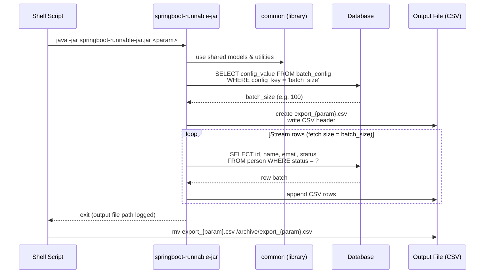

# springboot-runnable-jar
Simple spring boot app that reads a table and writes to a file.

## Architecture

```mermaid
sequenceDiagram
    participant SH as Shell Script
    participant JAR as springboot-runnable-jar
    participant COM as common (library)
    participant DB as Database
    participant FILE as Output File (CSV)

    SH->>JAR: java -jar springboot-runnable-jar.jar <param>

    JAR->>COM: use shared models & utilities

    JAR->>DB: SELECT config_value FROM batch_config<br/>WHERE config_key = 'batch_size'
    DB-->>JAR: batch_size (e.g. 100)

    JAR->>FILE: create export_{param}.csv<br/>write CSV header

    loop Stream rows (fetch size = batch_size)
        JAR->>DB: SELECT id, name, email, status<br/>FROM person WHERE status = ?
        DB-->>JAR: row batch
        JAR->>FILE: append CSV rows
    end

    JAR-->>SH: exit (output file path logged)

    SH->>FILE: mv export_{param}.csv /archive/export_{param}.csv
```
